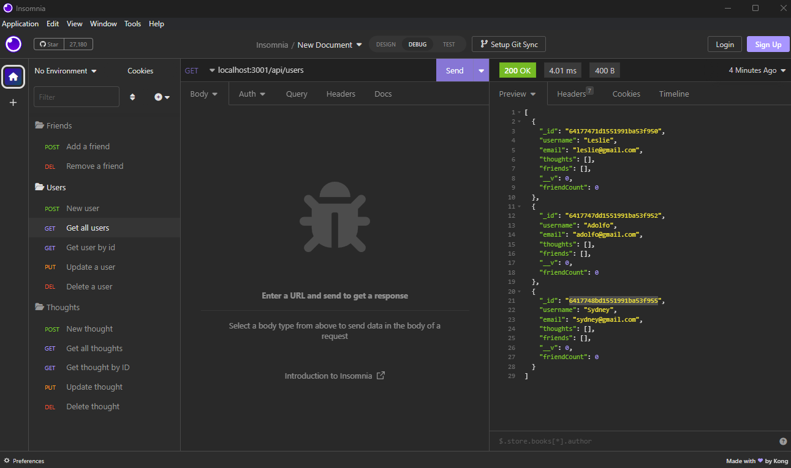

# social-network-api# social-network-api

## Table of Contents
* [Description](#description)
* [Installation](#installation)
* [Usage](#usage)
* [Questions](#questions)
* [Credits](#credits)
* [Licenses](#license)
* [Screenshots](#screenshots)

## Description
- Social network api creator so you can share thoughts, react to others thoughts and make a friends list

## Installation
- Visit the GitHub repo linked below and clone it to your local storage by downloading a zip or importing using GitHub to your own repo.
- Github repo: [https://github.com/lesliefg/social-network-api] 
- Tutorial: [https://drive.google.com/file/d/1pI-RwXjiCtIbZkfdR1KRjS80aIm8icc_/view]

### Make sure to have the following things installed
* VS Code
* GitBash
* Node.js
* MongoDB and Mongo Compass [Download](https://coding-boot-camp.github.io/full-stack/mongodb/how-to-install-mongodb)

### Then follow these steps to install the project
1. Follow the Github repo link above.
2. Clone the repo using Gitbash with the command "git clone (link)" OR download the entire repo as a zip file.
3. Once open in VS Code, use "npm i" in the terminal
4. To start the app use `npm start` in terminal
5. Open MongoDB Compass and use `mongodb://localhost:27017` 

## Usage
- Tutorial video: [https://drive.google.com/file/d/1pI-RwXjiCtIbZkfdR1KRjS80aIm8icc_/view]
- Github repo: [https://github.com/lesliefg/social-network-api] 

## Questions
- For any questions checkout the repo or reach out via email!  
- GitHub: [https://github.com/lesliefg]
- Email: leslie.garcia2433@gmail.com

## Credits
- Code written by Leslie. 
- Referenced UoM mini project for examples/help.

## Licenses
    - This project has a MIT license. To learn more about this license type click the license button at the top of the README.

## Screenshots

Screenshots and a video are provided in the assets folder as well. Below is a breakdown of each screenshot and how each route works. 

### Users
Creating a new user - to create a new user use the route `localhost:3001/api/users` and use POST in insomnia for the method. Next change Body to JSON and use the following formatting: 
`{
	"username": "Sydney",
	"email": "sydney@gmail.com"
}`
Update the username and email to what you would like your user to reflect then hit Send and it should reflect on the right side preview.

Getting all users - To get all users use the GET method and use the route `localhost:3001/api/users` this will reflect all existing users in the right side preview. 

Getting one user - to get a single user, look up all users and find the specific user ID then use the following route with a GET method `localhost:3001/api/users/:UserID` replacing `:UserID` with the actual ID. Then the user, their thoughts and friends list will reflect in the right side preview.

Updating a User - to update a user you'll be using a PUT method with the following route `localhost:3001/api/users/:UserID` and the following formatting in the JSON field. 
`{
	"_id": "64177471d1551991ba53f950",
	"username": "Lesly",
	"email": "leslie@gmail.com",
	"thoughts": [],
	"friends": [
		"6417747dd1551991ba53f952"
	],
	"__v": 0,
	"friendCount": 1
}`

You can then update the username or email through here.

Deleting a User - to delete a user use the DELETE method and the following route `localhost:3001/api/users/:UserID` it will then display "User and thoughts deleted" since it will also delete any thoughts from that user.

### Thoughts
New Thought - To make a new thought you'll use a POST method and the following route `localhost:3001/api/thoughts` with the following formatting in a JSON 
`{
	"thoughtText": "With a y but it's not where you think lol",
	"username": "Lesly",
	"userId": "64177471d1551991ba53f950"
}`

Replacing username and userID with the respective information.

Getting Thoughts - to get all thoughts use a GET method with the following route `localhost:3001/api/thoughts` it will then preview all posted thoughts on the right side.
 

Get one thought - to get a single though you'll use a GET method and the following route `localhost:3001/api/thoughts/:thoughtID` this will pull up the one thought in the preview.
 

Updating a thought - to update a thought you'll use a PUT method with the following route `localhost:3001/api/thoughts/:thoughtID` and the following JSON formatting
`{
	"_id": "641776afd1551991ba53f960",
	"thoughtText": "Changing my name from leslie to lesly!!!",
	"username": "Lesly"
}` 
Replacing the needed information.

Deleting a thought - To delete a thought you'll use the DELETE method and the following route `localhost:3001/api/thoughts/:thoughtID` and the preview will show "Thought deleted" afterwards.
 

### Friends

Adding a friend - To add a friend you'll use a POST method with the following route `localhost:3001/api/users/:userId/friends/:UserID` here you will need to use two user IDs. You'll use `friends` in between and then they'll be added to eachothers friend list. If you return to the GET User request you can then see their friends list and friend count updated.
 

Deleting a friend - To delete a friend you'll use a DELETE method with the following route `localhost:3001/api/users/:userId/friends/:UserID` here you will need to use two user IDs. You'll use `friends` in between and then they'll be removed from eachothers friend list. If you return to the GET User request you can then see their friends list and friend count updated.
 

### Reactions

Creating a reaction - to create a reaction you'll use a POST method with the following route `localhost:3001/api/thoughts/:thoughtID/reactions` replacing `:thoughtID` with the actual thoughts ID. Then use the following format in the JSON 
`{
	"reactionBody": "Haha like from marvel!",
	"username": "Adolfo"
}`
Updating the information to what you'd like it to say
 

Deleting a reaction - to delete a reaction you'll use the DELETE method and the following route `localhost:3001/api/thoughts/:thoughtID/reactions/:reactionID` replacing both the thoughtID and reactionID. This will then delete and you can verify by going to the Get Thought by ID and seeing the listed reactions or lack of, there.
 